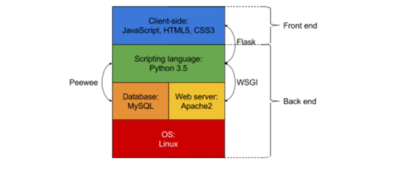

# Open Door Data

This application was built for our group's UCD Summer Practicum course. In this research semester we attempted to create an application that was able to predict classroom occupancy based on the number of devices connected to a wireless access point associated with that particular classroom. The outcome of this project was a fully packaged application that contains displays for the occupancy data and historical data, an API and an Admin page. Here we will go over some of the different parts of the project.

We built this project using: 

An MVC architecture pattern
&nbsp;

&nbsp;

A LAMP stack
&nbsp;

&nbsp;

Our full application architecture was based on the Flask-Peewee framework, designed using the Django methodology, and is encapsulated in the following image:
&nbsp; 

&nbsp;

Our back-end is composed of many different files that are built to be modular and serve a specific purpose while also interaction with other the other files. 

Our front-end is composed of nine different pages:

The home page is a general splash page that explains the site and what it does:
&nbsp;

&nbsp;

The Api page contains our documentation for accessing and querying our sites API:
&nbsp;

&nbsp;

The Login page is a general login page that allows users to login to access specific parts of the application:
&nbsp;

&nbsp;

The Survey page allows authorized users to submit new data on how full a room is:
&nbsp;

&nbsp;

The Admin page allows authorized users to add/edit/delete certain database tables:
&nbsp;

&nbsp;

The Dashboard general page displays the occupancy of a room based on a week and occupancy level selected by a user:
&nbsp;

&nbsp;

The Dashboard building page displays information on the buildings contained in the Database:
&nbsp;

&nbsp;

The Dashboard room page displays historical usage information on the rooms contained in the Database:
&nbsp;

&nbsp;

The Dashboard Module page displays information on historical room usage based on module selected by a user:
&nbsp;

&nbsp;

## Getting Started

These instructions will get you a copy of the project up and running on your local machine for development and testing purposes.

### Installing

To install Open Door Data either pip or easy_install the full Git address of this application. All modules required for this application will be installed as well.

## Deployment

Add additional notes about how to deploy this on a live system

## Versioning

All versioning of this project was done on UCD Git.

## Authors

* **Elayne Ruane** 
* **Pauline Lallinec** 
* **Jack Halpin** 
* **Don Blaine** 

## License

This project is licensed under the MIT License - see the LICENSE.txt file for details

## Acknowledgments

* We'd like to thank everyone who created the packages that were used in this project. 